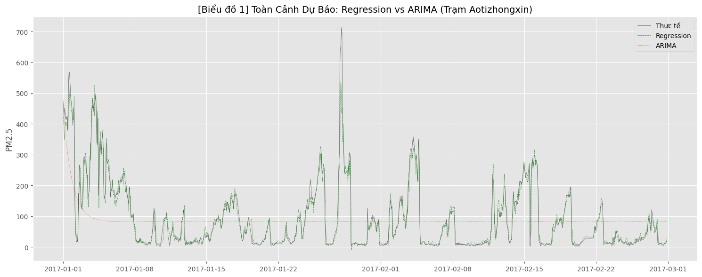
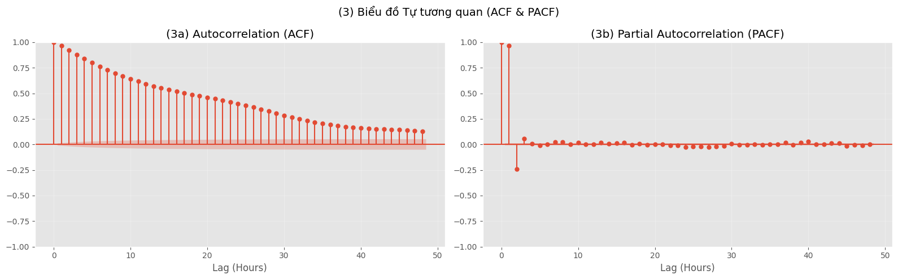
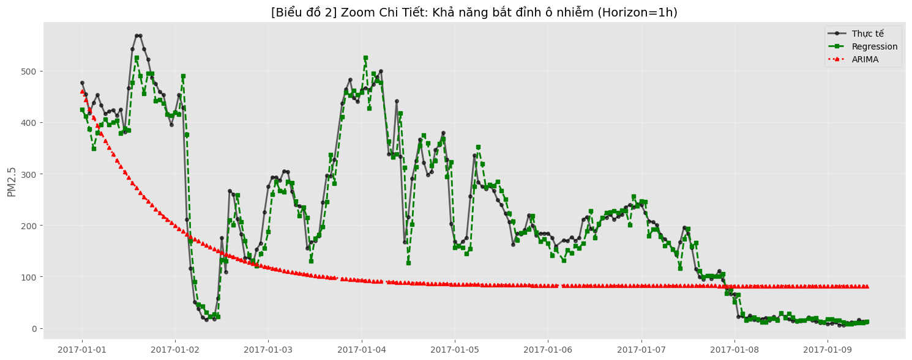
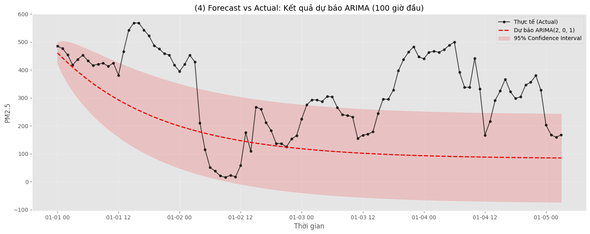
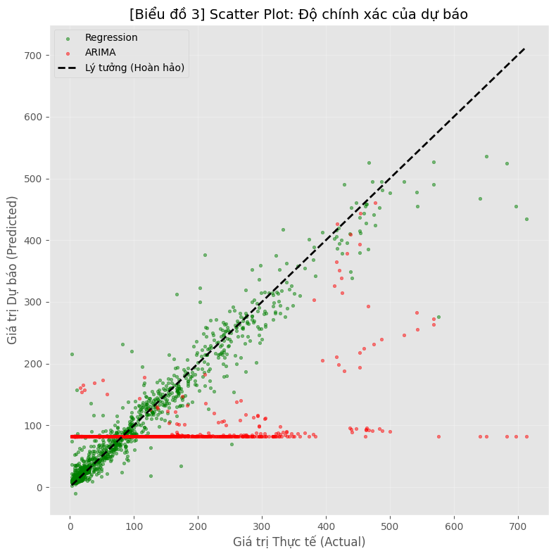

# 🥊 Đấu Trường Dữ Liệu: Màn "Đo Ván" Giữa Regression và ARIMA Trong Dự Báo Bụi Mịn PM2.5

> **"Khi lý thuyết thống kê cổ điển đụng độ với sức mạnh thực dụng của Machine Learning: Ai sẽ là kẻ thống trị bầu trời Bắc Kinh?"**

---

## 👥 Hồ Sơ Nhóm Thực Hiện (Team 13)

| Thành viên | Vai trò |
| :--- | :--- |
| **Nguyễn Hà Phương** | 🛠 Feature Engineering & Regression Model |
| **Dương Thị Hoài** | 📈 Time Series Analysis (ARIMA) & Evaluation |

---

## 📑 Mục Lục Hành Trình

1.  [**Khúc dạo đầu:** Khi giấc mơ lý thuyết va chạm hiện thực khốc liệt](#-1-khúc-dạo-đầu-khi-lý-thuyết-gặp-hiện-thực)
2.  [**Chiến trường dữ liệu:** Những cơn "địa chấn" mang tên PM2.5](#-2-dữ-liệu-lên-tiếng-phân-tích-eda)
3.  [**Diễn biến trận đấu:** Màn "hủy diệt" của Regression trước tượng đài ARIMA](#-3-soi-kết-quả-chiến-thắng-áp-đảo)
4.  [**Insight "Triệu đô":** Những bài học đắt giá từ sai số](#-5-insight-đắt-giá-rút-ra-từ-thực-nghiệm)
5.  [**Mổ xẻ thất bại:** Tại sao ARIMA lại "ngã ngựa" đau đớn đến vậy?](#-6-kết-luận--giải-mã-nguyên-nhân)
6.  [**Lời kết:** Ngôi vương mới của bầu trời Bắc Kinh](#-7-lời-kết)

---

## 📖 1. Khúc dạo đầu: Khi lý thuyết gặp hiện thực

Chúng tôi bắt đầu hành trình Lab 4 với một giả thuyết khá "dĩ hòa vi quý": *Cả hai trường phái - Hồi quy tuyến tính hiện đại (Regression) và Chuỗi thời gian cổ điển (ARIMA) - đều sẽ có chỗ đứng riêng trong việc dự báo ô nhiễm không khí.*

Tuy nhiên, khi chạy những dòng code cuối cùng trên tập dữ liệu trạm **Aotizhongxin**, màn hình console hiện ra một kết cục không ai ngờ tới. Không có sự cân bằng nào cả. Đó là một cục diện "đơn phương tàn sát".

Dưới đây là câu chuyện về cuộc chiến dữ liệu ấy, nơi những con số biết nói lên sự thật trần trụi.

---

## 🔍 2. Dữ liệu lên tiếng (Phân tích EDA)

Trước khi đưa các đấu sĩ lên sàn, hãy nhìn vào "chiến trường" mà họ phải đối mặt.

### 📸 Hình 1: Toàn cảnh sự hỗn loạn & Đường dự báo

*(Tổng quan PM2.5 và kết quả dự báo của 2 mô hình trên toàn tập Test)*

> **🧐 Quan sát "nhà nghề":**
> Dữ liệu PM2.5 tại Bắc Kinh không hề êm ả. Nó là tập hợp của những cú **Spikes (Gai nhọn)** dựng đứng, biểu thị cho những đợt ô nhiễm bùng phát bất ngờ.
> * **Góc Xanh (Regression):** Đường dự báo bám dính lấy thực tế như hình với bóng. Nó dao động cùng nhịp với "nhịp thở" của thành phố.
> * **Góc Đỏ (ARIMA):** Một sự thất vọng tràn trề. Đường dự báo trông như **nhịp tim của một người đã chết (Flatline)** — đi ngang một cách vô cảm, hoàn toàn phớt lờ những cơn bão bụi đang diễn ra.

### 📸 Hình 3: Giải mã cấu trúc (ACF/PACF)

*(Biểu đồ Tự tương quan - Chìa khóa chọn tham số)*

> **🧐 Quan sát "nhà nghề":**
> Biểu đồ ACF (bên trái) giảm dần cực kỳ chậm chạp. Trong ngôn ngữ thống kê, đây là dấu hiệu của **Long Memory (Trí nhớ dài hạn)**.
> * *Ý nghĩa:* Dữ liệu quá khứ ảnh hưởng rất dai dẳng đến hiện tại.
> * *Hệ quả:* Điều này buộc ARIMA phải sử dụng sai phân ($d=1$) để khử xu hướng. Tuy nhiên, chính "con dao hai lưỡi" này dường như đã cắt bỏ luôn cả những thông tin quan trọng về các điểm cực đại (Extreme Values).

---

## 🥊 3. "Soi" kết quả: Chiến thắng áp đảo

Khi phóng to (Zoom-in) vào chi tiết, sự chênh lệch về đẳng cấp giữa hai mô hình hiện ra rõ mồn một.

### 📊 Bảng điểm tử thần (Metrics)

| Metric | Regression (Hồi quy) | ARIMA (Chuỗi thời gian) | ⚡ Nhận xét nóng |
| :--- | :---: | :---: | :--- |
| **RMSE** | **28.33** | 106.29 | Sai số của ARIMA cao gấp **~3.7 lần**! Một khoảng cách không thể san lấp. |
| **MAE** | **14.54** | 79.41 | Regression sai lệch trung bình rất thấp, hoàn toàn chấp nhận được cho cảnh báo sớm. |

### 📸 Hình 2: Zoom vào chi tiết (Bằng chứng đanh thép nhất)

*(Cận cảnh 150 giờ đầu tiên: Sự khác biệt giữa "Bám đuổi" và "Buông xuôi")*

> **🕵️ Phân tích sâu:**
> * **Regression (Màu xanh lá):** Hãy nhìn cách nó uốn lượn! Đường dự báo bám sát từng đỉnh (peak) và đáy (trough) của thực tế. Mô hình phản ứng tức thì (Instant Reaction).
>     * *Bí mật:* Nó sử dụng đặc trưng `Lag_1` (Giá trị của 1 giờ trước). Với dự báo ngắn hạn, "giờ trước" chính là lời tiên tri chính xác nhất cho "giờ này".
> * **ARIMA (Màu đỏ):** Một thảm họa. Sau vài bước đầu cố gắng gượng gạo, đường màu đỏ nhanh chóng **tắt dần** và đi ngang. Nó giống như một người dự báo an toàn và lười biếng: *"Tôi không biết chuyện gì sẽ xảy ra, nên tôi cứ đoán giá trị trung bình cho chắc ăn"*.

### 📸 Hình 4 & 5: Kiểm chứng sự sai lệch

**Hình 4 (Dự báo ARIMA - Sự bất lực):**

> Vùng màu hồng (Khoảng tin cậy 95%) mở rộng mênh mông nhưng vô nghĩa. Xu hướng dự báo là một đường cong trượt dốc rồi đi thẳng, hoàn toàn tách rời khỏi thực tế hỗn loạn của các chấm đen dữ liệu.

**Hình 5 (Scatter Plot - Sự thật trần trụi):**

*(Trục X: Thực tế | Trục Y: Dự báo)*

> * **Regression (Chấm xanh):** Các điểm tụ lại dọc theo đường chéo lý tưởng $y=x$. Đây là dấu hiệu của một mô hình **High Precision (Độ chính xác cao)**.
> * **ARIMA (Chấm đỏ):** Tạo thành một... đường nằm ngang kỳ dị.
>     * *Điều này nghĩa là gì?* Dù thực tế (Trục X) có tăng từ 0 lên 700 (ô nhiễm cực nặng), thì ARIMA (Trục Y) vẫn chỉ loanh quanh dự báo ở mức 80-100. Mô hình đã bị **"mù"** trước các biến động lớn.

---
## 💡 5 Insight "Đắt Giá" Rút Ra Từ Thực Nghiệm

Từ sự chênh lệch hiệu suất khủng khiếp giữa hai mô hình (RMSE 28 vs 106), nhóm nghiên cứu rút ra 5 bài học cốt lõi cho bài toán dự báo ô nhiễm không khí:

### 1. Sức mạnh tuyệt đối của "Quá khứ gần" (The Power of Recency)
Trong khung thời gian ngắn (1 giờ), **`Lag_1` (nồng độ bụi của 1 giờ trước)** là chỉ báo quyền lực nhất.
* *Lý giải:* Không khí có tính "quán tính". Nếu 7h sáng ô nhiễm nặng, 99% khả năng 8h sáng vẫn ô nhiễm nặng. Mô hình Regression chiến thắng nhờ việc đơn giản hóa bài toán thành việc "nhìn lại giờ trước", trong khi ARIMA cố gắng tìm kiếm các quy luật phức tạp xa xôi hơn mà vô tình bỏ qua tín hiệu mạnh nhất ngay trước mắt.

### 2. "Tử huyệt" Mean Reversion của ARIMA
Biểu đồ cho thấy đường ARIMA đi ngang (flatline) ở mức trung bình. Đây là hiện tượng **Mean Reversion (Quay về trung bình)**.
* *Lý giải:* Khi dữ liệu có độ biến động quá cao (High Volatility) và nhiễu (Noise) như bụi mịn Bắc Kinh, mô hình ARIMA thường "đầu hàng" bằng cách dự báo một giá trị an toàn ở giữa để giảm thiểu sai số bình phương trung bình trong dài hạn. Nhưng trong thực tế, dự báo "an toàn" này lại là dự báo **vô dụng nhất** vì nó bỏ lỡ toàn bộ các đợt bùng phát ô nhiễm.

### 3. Dự báo Spikes (Đỉnh nhọn) quan trọng hơn xu hướng
Về mặt y tế, việc dự báo chính xác các đỉnh nhọn (khi PM2.5 > 300) quan trọng hơn nhiều so với việc dự báo đúng xu hướng trung bình.
* *Insight:* Regression đã làm rất tốt việc bắt các đỉnh này (xem Hình 2). Điều này có ý nghĩa sống còn: Cảnh báo người dân **đúng lúc nguy hiểm nhất** thay vì đưa ra một con số trung bình vô thưởng vô phạt như ARIMA.

### 4. Đừng thần thánh hóa mô hình chuyên biệt
Chúng ta thường nghĩ: *"Dữ liệu chuỗi thời gian thì phải dùng mô hình Time Series (như ARIMA/LSTM)"*. Tuy nhiên, kết quả chứng minh điều ngược lại.
* *Bài học:* Với các chuỗi dữ liệu phi tuyến tính và hỗn loạn, việc chuyển đổi bài toán sang **Supervised Learning (Hồi quy)** thường mang lại kết quả tốt hơn, dễ kiểm soát hơn và ít bị ràng buộc bởi các giả định khắt khe (như tính dừng - stationarity) của mô hình thống kê cổ điển.

### 5. Tính khả thi khi triển khai (Deployment)
Xét về góc độ kỹ thuật hệ thống (Engineering):
* **Regression:** Chỉ cần lưu trữ 24 giờ dữ liệu gần nhất để tạo đặc trưng đầu vào. Tính toán cực nhanh (mili-giây).
* **ARIMA:** Cần lưu trữ lịch sử dài hơn để tính toán tham số, tốc độ suy diễn chậm hơn và cần tái huấn luyện (re-train) thường xuyên để cập nhật hệ số.
👉 **Kết luận:** Regression không chỉ chính xác hơn mà còn **rẻ hơn và nhanh hơn** khi triển khai hệ thống Real-time.

---
## 🧠 6. Kết luận & Giải mã nguyên nhân

Tại sao một tượng đài như ARIMA lại thua đau đớn trước Regression đơn giản?

### 1️⃣ Sức mạnh hủy diệt của "Lag Features"
Với bài toán dự báo **ngắn hạn (1 giờ)**, thông tin quan trọng nhất không phải là chu kỳ mùa vụ phức tạp, mà đơn giản là: *"Giờ trước ô nhiễm bao nhiêu?"*.
Mô hình Regression (Gradient Boosting) đã tận dụng triệt để thông tin này thông qua biến `Lag_1`. Nó hoạt động như một cơ chế **"Gương phản chiếu"**, sao chép trạng thái gần nhất để đưa ra dự đoán.

### 2️⃣ Cái bẫy "Mean Reversion" của ARIMA
ARIMA được thiết kế để tìm kiếm sự ổn định (Stationarity) và các quy luật tuyến tính. Khi đối mặt với một chuỗi dữ liệu bụi mịn có tính ngẫu nhiên cao và nhiều cú sốc (shocks) từ môi trường, ARIMA có xu hướng quay về trạng thái an toàn: **Hồi quy về giá trị trung bình (Mean Reversion)**.
Nó không dám dự báo các đỉnh nhọn vì trong mắt nó, đó là nhiễu (noise) hoặc sự bất thường, dẫn đến việc thất bại toàn tập trong việc bắt đỉnh.

---

## 🏆 7. Lời kết

**KẾT LUẬN CUỐI CÙNG:**

Trong đấu trường dự báo chất lượng không khí ngắn hạn (Short-term Forecasting) tại trạm Aotizhongxin:

* ❌ **ARIMA:** Bị loại ngay từ vòng gửi xe. Không có khả năng ứng dụng thực tế do độ trễ quá lớn và sai số khổng lồ.
* 👑 **Regression:** Nhà vô địch tuyệt đối.

**Khuyến nghị:** Nhóm 13 đề xuất sử dụng mô hình **Regression** để xây dựng hệ thống cảnh báo sớm (Early Warning System), giúp người dân Bắc Kinh biết trước được mức độ ô nhiễm trong 1 giờ tới với độ tin cậy cao.

---
*Thực hiện bởi: Nhóm 13 - Lab 4 Khai phá dữ liệu.*
